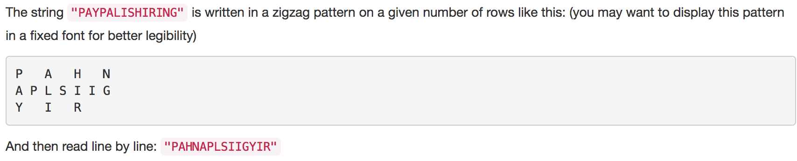

```javascript
function isScramble(s1, s2) {
    if (s1.length !== s2.length) {
        return false;
    }
    if (!s1 || s1 === s2) {
        return true;
    }
    const copy1 = s1.split("").sort().join("");
    const copy2 = s2.split("").sort().join("");
    if (copy1 !== copy2) {
        return false;
    }
    for (let i = 1; i < s1.length; i++) {
        const str1 = s1.slice(0, i);
        const str2 = s1.slice(i, s1.length);
        const str3 = s2.slice(0, i);
        const str4 = s2.slice(i, s2.length);
        const str5 = s2.slice(0, s2.length - i);
        const str6 = s2.slice(s2.length - i, s2.length);
        if ((isScramble(str1, str3) && isScramble(str2, str4)) || (isScramble(str1, str6) && isScramble(str2, str5))) {
            return true;
        }
    }
    return false;
}

isScramble("great", "rgeat");
```
Given a string S and a string T, find the minimum window in S which will contain all the characters in T in complexity O(n).
```javascript
function minWindow(s, t) {
    let res = "";
    if (t.length > s.length) {
        return res;
    }
    const target = p.split("").reduce((obj, val) => {
        if (obj[val]) {
            obj[val]++;
        } else {
            obj[val] = 1;
        }
        return obj;
    }, {});
    let left = 0, count = 0, minLen = s.length + 1;
    const map = {};
    s.split("").forEach((e, i) => {
        if (target[e]) {
            if (map[e]) {
                if (map[e] < target[e]) {
                    count++;
                }
                map[e]++;
            } else {
                map[e] = 1;
                count++;
            }
        }
        if (count === t.length) {
            let curr = s[left];
            while (!map[curr] || map[curr] > target[curr]) {
                if (map[curr] && map[curr] > target[curr]) {
                    map[curr]--;
                }
                left++;
                curr = s[left];
            }
            if (i - left + 1 < minLen) {
                res = s.slice(left, i + 1);
                minLen = i - left + 1;
            }
        }
    });
    return res;
}

minWindow("ADOBECODEBANC", "ABC");
```

```javascript
const arr = ["What", "must", "be", "acknowledgment", "shall", "be"];

function createLine(words, maxWidth, start, end, currWordsLen, isLast) {
    let res = "";
    if (start < 0 || end >= words.length) {
        return res;
    }
    res = words[start];
    const numOfWords = end - start + 1;
    if (numOfWords === 1 || isLast) {
        for (let i = start + 1; i <= end; i++) {
            res += ` ${words[i]}`;
        }
        const remaining = maxWidth - currWordsLen - (numOfWords - 1);
        for (let i = 0; i < remaining; i++) {
            res += " ";
        }
        return res;
    }
    const k = Math.floor((maxWidth - currWordsLen) / (numOfWords - 1));
    const m = (maxWidth - currWordsLen) % (numOfWords - 1);
    for (let i = start + 1; i <= end; i++) {
        const nSpace = i - start <= m ? k + 1 : k;
        for (let j = 0; j < nSpace; j++) {
            res += " ";
        }
        res += words[i];
    }
    return res;
}

function fullJustify(words, maxWidth) {
    const res = [];
    let start = 0, end = -1, currWordsLen = 0, i = 0;
    while (i < words.length) {
        if (words[i].length > maxWidth) {
            return res;
        }
        const newLen = currWordsLen + end - start + 1 + words[i].length;
        if (newLen <= maxWidth) {
            end = i;
            currWordsLen += words[i].length;
            i++;
        } else {
            const line = createLine(words, maxWidth, start, end, currWordsLen, false);
            res.push(line);
            start = i;
            end = i - 1;
            currWordsLen = 0;
        }
    }
    const lastLine = createLine(words, maxWidth, start, end, currWordsLen, true);
    res.push(lastLine);
    return res;
}

console.log(JSON.stringify(fullJustify(arr, 16), null, 2));
```
Given an absolute path for a file (Unix-style), simplify it.

For example,
path = "/home/", => "/home"
path = "/a/./b/../../c/", => "/c"
```javascript
function simplifyPath(path) {
    const res = [];
    path.split("/").forEach(e => {
        if (e === "..") {
            res.pop();
        } else if (e !== "" && e !== ".") {
            res.push(e);
        }
    });
    return `/${res.join("/")}`;
}

simplifyPath("/a/./b/../../c/");
```
Implement a basic calculator to evaluate a simple expression string.
The expression string may contain open "(" and closing parentheses ")", the plus "+" or minus sign "-", non-negative integers and empty spaces " ".
```javascript
function basicCalc(s) {
    const stack = [1, 1];
    let sum = 0, i, j;
    for (i = 0; i < s.length; i++) {
        if (!isNaN(parseInt(s[i], 10))) {
            let num = parseInt(s[i], 10);
            for (j = i + 1; j < s.length && !isNaN(parseInt(s[j], 10)); j++) {
                num = num * 10 + parseInt(s[j], 10);
            }
            sum += stack.pop() * num;
            i = j - 1;
        } else if (s[i] === "+" || s[i] === "(") {
            stack.push(stack[stack.length - 1]);
        } else if (s[i] === "-") {
            stack.push(stack[stack.length - 1] * -1);
        } else if (s[i] === ")") {
            stack.pop();
        }
    }
    return sum;
}

basicCalc("(1+(4+5+2)-3)+(6+8)");
```

```javascript
function convert(s, numRows) {
    let res = "";
    if (!s || numRows <= 0) {
        return res;
    }
    if (numRows === 1) {
        return s;
    }
    const size = numRows * 2 - 2;
    for (let i = 0; i < numRows; i++) {
        for (let j = i; j < s.length; j += size) {
            res += s[j];
            if (i !== 0 && i !== numRows - 1) {
                const curr = j + size - 2 * i;
                if (curr < s.length) {
                    res += s[curr];
                }
            }
        }
    }
    return res;
}

convert("PAYPALISHIRING", 3); // PAHNAPLSIIGYIR
```
Given a string S and a string T, count the number of distinct subsequences of S which equals T.
A subsequence of a string is a new string which is formed from the original string by deleting some (can be none) of the characters without disturbing the relative positions of the remaining characters. (ie, "ACE" is a subsequence of "ABCDE" while "AEC" is not).
```javascript
function numDistinct(s, t) {
    if (!s || !t) {
        return 0;
    }
    const mem = Array(t.length).fill(0);
    s.split("").forEach(e => {
        for (let i = t.length - 1; i >= 0; i--) {
            if (e === t[i]) {
                mem[i] = mem[i] + (i >= 1 ? mem[i - 1] : 1);
            }
        }
    });
    return mem[t.length - 1];
}

numDistinct("babgbag", "bag");
```
