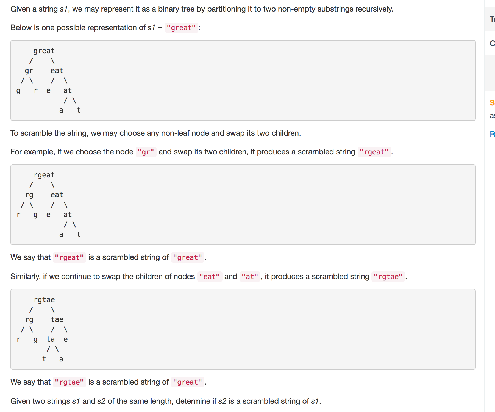
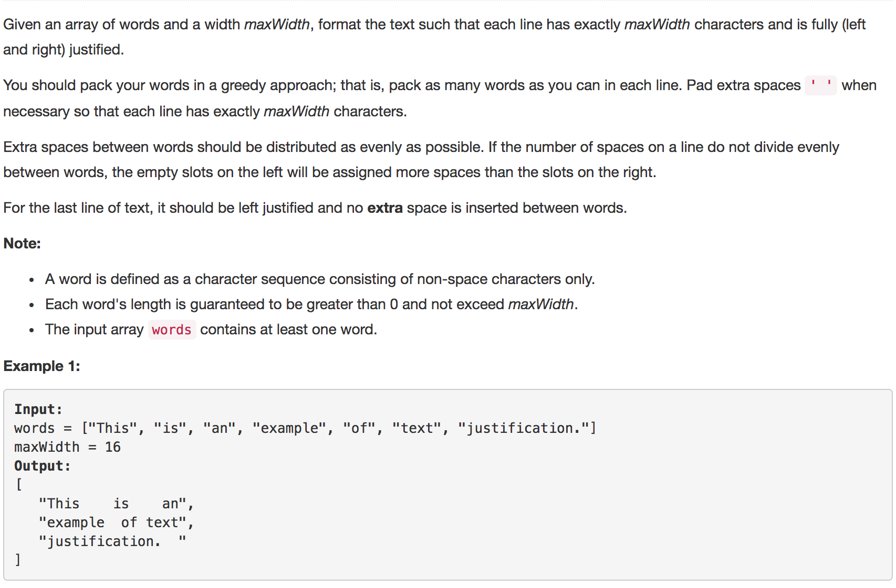

```javascript
function isScramble(s1, s2) {
    if (s1.length !== s2.length) {
        return false;
    }
    if (s1.length === 0 || s1 === s2) {
        return true;
    }
    const copy1 = s1.split("").sort().join("");
    const copy2 = s2.split("").sort().join("");
    if (copy1 !== copy2) {
        return false;
    }
    for (let i = 1; i < s1.length; i++) {
        const str1 = s1.slice(0, i);
        const str2 = s1.slice(i, s1.length);
        const str3 = s2.slice(0, i);
        const str4 = s2.slice(i, s2.length);
        const str5 = s2.slice(0, s2.length - i);
        const str6 = s2.slice(s2.length - i, s2.length);
        if (isScramble(str1, str3) && isScramble(str2, str4)) {
            return true;
        }
        if (isScramble(str1, str6) && isScramble(str2, str5)) {
            return true;
        }
    }
    return false;
}

isScramble("great", "rgeat");
```
Given a string S and a string T, find the minimum window in S which will contain all the characters in T in complexity O(n).
```javascript
function minWindow(s, t) {
    let res = "";
    if (t.length > s.length) {
        return res;
    }
    const target = p.split("").reduce((obj, val) => {
        if (obj[val]) {
            obj[val]++;
        } else {
            obj[val] = 1;
        }
        return obj;
    }, {});
    let left = 0, count = 0, minLen = s.length + 1;
    const map = {};
    s.split("").forEach((e, i) => {
        if (target[e]) {
            if (map[e]) {
                if (map[e] < target[e]) {
                    count++;
                }
                map[e]++;
            } else {
                map[e] = 1;
                count++;
            }
        }
        if (count === t.length) {
            let curr = s[left];
            while (!map[curr] || map[curr] > target[curr]) {
                if (map[curr] && map[curr] > target[curr]) {
                    map[curr]--;
                }
                left++;
                curr = s[left];
            }
            if (i - left + 1 < minLen) {
                res = s.slice(left, i + 1);
                minLen = i - left + 1;
            }
        }
    });
    return res;
}

minWindow("ADOBECODEBANC", "ABC");
```

```javascript
function createLine(words, maxWidth, start, end, currentWordsLen, isLast) {
    var result = '';
    if(start < 0 || end >= words.length) {
        return result;
    }

    result += words[start]; // consume the first word
    var numberOfWords = end - start + 1; // number of words to insert in this line

    // special case: one word or last line - left justified
    if(numberOfWords === 1 || isLast) {
        for(var i = start + 1; i <= end; i++) { // start from start + 1 since we already append the first word
            result += (" " + words[i]);
        }

        var remainingSpaces = maxWidth - currentWordsLen - (numberOfWords - 1);
        for(i = 0; i < remainingSpaces; i++) {
            result += ' ';
        }

        return result;
    }

    var k = parseInt((maxWidth - currentWordsLen)/(numberOfWords - 1));
    var m = (maxWidth - currentWordsLen)%(numberOfWords - 1);

    for(i = start + 1; i <= end; i++) { // start from start + 1 since we already append the first word
        var nspace = i - start <= m ? k + 1: k;

        for(var j = 0; j < nspace; j++) {
            result += ' ';    
        }

        result += words[i];
    }
    return result;
}

function fullJustify(words, maxWidth) {
    var result = [];
    var start = 0;
    var end = -1;
    var currentWordsLen = 0;
    var i = 0;

    while(i < words.length) {
        if(words[i].size > maxWidth) {
            return result;
        }

        var newLen = currentWordsLen + (end - start + 1) + words[i].length; // current words len + their spaces + new word

        if(newLen <= maxWidth) { // words[i] can fit in the current line
            end = i;
            currentWordsLen += words[i].length;
            i++;
        } else {
            var line = createLine(words, maxWidth, start, end, currentWordsLen, false);
            result.push(line);
            start = i;
            end = i - 1;
            currentWordsLen = 0;
        }
    }

    var lastLine = createLine(words, maxWidth, start, end, currentWordsLen, true);
    result.push(lastLine);
    return result;
};
```
